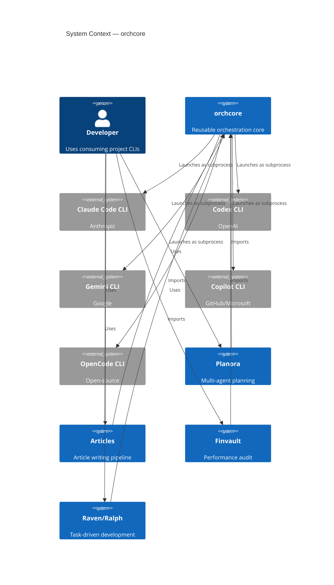
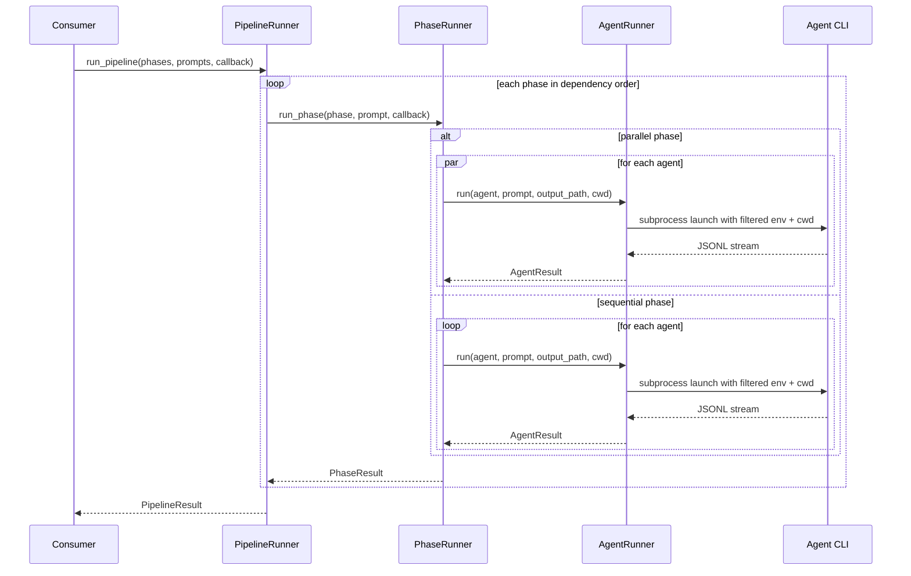

# Architecture Overview

**Version:** 1.0 | **Date:** 2026-03-25 | **Author:** Abdelaziz Abdelrasol

---

## Executive Summary

orchcore is a reusable Python package (>= 3.12, asyncio-first) that provides orchestration infrastructure for launching, monitoring, and managing multiple AI coding agent CLIs through phase-based pipelines. It is not an agent itself — it orchestrates external agent CLIs (Claude Code, Codex, Gemini, Copilot, OpenCode) as subprocesses.

The package was extracted by analyzing four production orchestration systems — Planora, Articles, Finvault, and Raven/Ralph — identifying the common infrastructure patterns (60-70% of code) that recurred across all four, and packaging them into a single reusable library. Domain-specific logic (prompt content, output interpretation, presentation) stays in each consuming project; orchcore provides the "how" of orchestration.

## Key Architectural Decisions

1. **Protocol-based UI decoupling** via `UICallback` so any project can plug its own CLI, TUI, or headless output ([ADR-003](adrs/003-protocol-based-ui-decoupling.md))
2. **Composable four-stage stream processing pipeline** (Filter, Parse, Monitor, Stall Detect) that normalizes the wildly different JSONL formats across agent CLIs into a unified event model ([ADR-004](adrs/004-composable-stream-processing-pipeline.md))
3. **Registry-as-data**, where agent configurations are defined via TOML/dict rather than hardcoded classes, making the system extensible without code changes ([ADR-007](adrs/007-registry-pattern-for-agent-management.md))

## System Context (C4 Level 1)



## Package Layout

```
src/orchcore/
├── stream/          # 4-stage JSONL processing pipeline
│   ├── events.py    # StreamEvent, StreamFormat, AgentState models
│   ├── filter.py    # StreamFilter — pre-parse noise reduction
│   ├── parser.py    # StreamParser — format-specific JSONL → StreamEvent
│   ├── monitor.py   # AgentMonitor — real-time state tracking
│   └── stall.py     # StallDetector — timeout detection
├── pipeline/        # Phase orchestration engine
│   ├── phase.py     # Phase, PhaseResult, PipelineResult models
│   ├── engine.py    # PhaseRunner — per-phase execution
│   ├── pipeline.py  # PipelineRunner — cross-phase coordination
│   └── control.py   # Control flow utilities
├── runner/          # Async subprocess management
│   └── subprocess.py  # AgentRunner
├── registry/        # Agent configuration
│   ├── agent.py     # AgentConfig, AgentMode, ToolSet models
│   └── registry.py  # AgentRegistry — TOML/dict lookup
├── config/          # Layered configuration
│   ├── settings.py  # OrchcoreSettings, load_settings_with_profile
│   └── schema.py    # AgentOverrideConfig
├── recovery/        # Rate-limit & error recovery
│   ├── rate_limit.py  # RateLimitDetector, ResetTimeParser
│   ├── retry.py     # RetryPolicy, FailureMode, BackoffStrategy
│   └── git_recovery.py  # GitRecovery
├── workspace/       # Artifact lifecycle
│   └── manager.py   # WorkspaceManager
├── prompt/          # Jinja2 templates
│   ├── template.py  # render_template, render_string, strip_frontmatter
│   └── loader.py    # TemplateLoader
├── display/         # ANSI colored logging (no Rich)
│   ├── logging.py   # log_info, log_error, status_line, phase_header
│   └── formatting.py  # format_cost, format_duration, format_tokens
├── ui/              # UICallback protocol
│   └── callback.py  # UICallback, NullCallback, LoggingCallback
├── signals/         # Graceful shutdown
│   └── handler.py   # SignalManager
├── observability/   # Optional OpenTelemetry
│   └── telemetry.py # OrchcoreTelemetry
└── __init__.py
```

## Component Diagram

```
┌─────────────────────────────────────────────────────────────────┐
│                      Consuming Project                          │
│  (Custom UICallback, Phase Definitions, Prompt Templates, TOML) │
└──────────────────────────────┬──────────────────────────────────┘
                               │
┌──────────────────────────────▼──────────────────────────────────┐
│                          orchcore                                │
│                                                                  │
│  ┌────────────┐  ┌────────────┐  ┌────────────┐  ┌───────────┐ │
│  │  pipeline/  │  │   runner/  │  │  registry/  │  │  config/  │ │
│  │ DAG phases  │─▶│ subprocess │─▶│ agent TOML  │  │  layered  │ │
│  │ seq/parallel│  │  async I/O │  │   lookup    │  │  settings │ │
│  └─────┬──────┘  └─────┬──────┘  └─────────────┘  └───────────┘ │
│        │               │                                         │
│  ┌─────▼───────────────▼──────────────────────────────────────┐ │
│  │                    stream/ (4-stage pipeline)               │ │
│  │  JSONL ─▶ Filter ─▶ Parse ─▶ Monitor ─▶ Stall Detect      │ │
│  └────────────────────────────────────────────────────────────┘ │
│                                                                  │
│  ┌──────────┐ ┌──────────┐ ┌─────────┐ ┌──────────┐ ┌────────┐│
│  │recovery/ │ │workspace/│ │ prompt/ │ │ signals/ │ │  ui/   ││
│  │rate-limit│ │ artifact │ │ Jinja2  │ │ graceful │ │Protocol││
│  │retry,git │ │lifecycle │ │templates│ │ shutdown │ │callback││
│  └──────────┘ └──────────┘ └─────────┘ └──────────┘ └────────┘│
└──────────────────────────────────────────────────────────────────┘
```

## Core Abstractions

### Pipeline Execution Model

orchcore uses a two-level execution model:

1. **PipelineRunner** — coordinates multiple phases in topological dependency order (dependencies first, declaration order preserved among independent phases — see [ADR-010](adrs/010-topological-phase-ordering-and-success-semantics.md)). Handles resume, skip, and only-phase options. A required phase whose dependencies are unmet fails the pipeline instead of silently counting as success.
2. **PhaseRunner** — executes a single phase. Launches agents sequentially or in parallel via `AgentRunner`, enforces concurrency limits, and aggregates results.
3. **AgentRunner** — launches each subprocess with an explicit command, filtered environment, optional working directory, stream parser, and process-tree shutdown policy.



### Stream Processing Pipeline

Every line of JSONL output passes through four composable stages:

1. **StreamFilter** — fast-path string matching drops ~95% of noise before `json.loads()`
2. **StreamParser** — format-specific parsers produce normalized `StreamEvent` instances
3. **AgentMonitor** — 9-state machine tracks agent lifecycle, tools, cost, tokens
4. **StallDetector** — injects synthetic `STALL` events after configurable timeout

See [Stream Pipeline](stream-pipeline.md) for the deep-dive.

### Tool Resolution Order

Tools available to an agent within a phase are resolved via a layered lookup:

```
Phase.agent_tools[agent]  >  explicit toolset  >  Phase.tools  >  AgentConfig.flags[mode]  >  defaults
```

See [ADR-009: Tool assignment as phase-level concern](adrs/009-tool-assignment-as-phase-level-concern.md).

## Design Principles

| Principle | How It's Applied |
|-----------|-----------------|
| **Composability** | Each of 12 components usable independently |
| **Extensibility** | New agents via TOML config alone (zero code changes) |
| **Reliability** | Graceful degradation, configurable partial failure semantics |
| **Performance** | < 5ms per event, < 100ms subprocess launch |
| **Type Safety** | mypy strict with Pydantic validation at boundaries |
| **Async-First** | Pure stdlib asyncio with explicit task creation, fail-fast waits, and gather-based result collection |
| **Protocol-Based DI** | UICallback is a Protocol, not a base class |
| **Registry-as-Data** | Agents defined via TOML/dict, not hardcoded classes |

## Quality Attributes

| Priority | Attribute | Target |
|----------|-----------|--------|
| 1 | Extensibility | New agent CLI via TOML only |
| 2 | Reliability | Graceful degradation under partial failure |
| 3 | Composability | Each component usable standalone |
| 4 | Performance | Stream < 5ms/event, launch < 100ms |
| 5 | Type Safety | mypy strict, zero errors |

## Constraints

- **Python >= 3.12** — `tomllib`, modern type syntax, and current asyncio APIs
- **asyncio only** — no trio, gevent, or threading
- **Core deps** — pydantic >= 2.10, pydantic-settings >= 2.7, jinja2 >= 3.1, tzdata >= 2024.1
- **No agent API keys** — agents manage their own authentication
- **Cross-platform signals** — event-loop handlers where available, classic signal fallback on Windows

## Related

- [Design Document](design.md) — problem statement, requirements, proposed design
- [Stream Pipeline](stream-pipeline.md) — 4-stage pipeline deep-dive
- [Architecture Decision Records](adrs/) — all 10 ADRs
